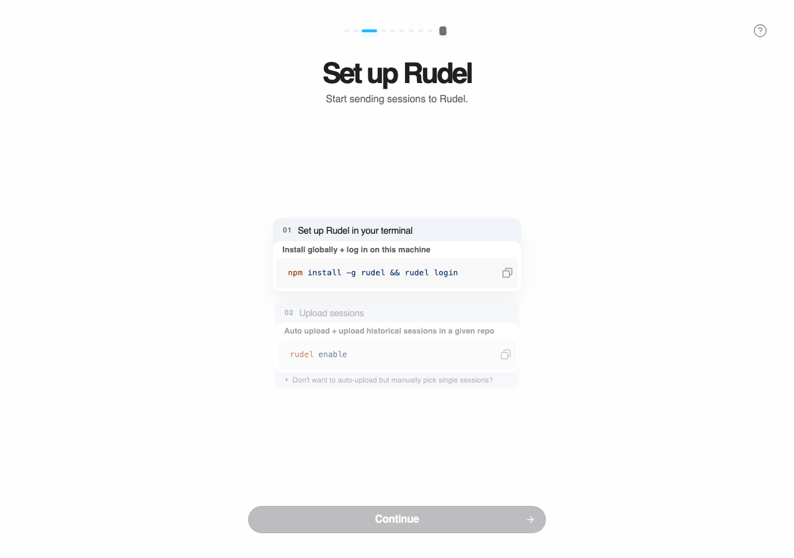
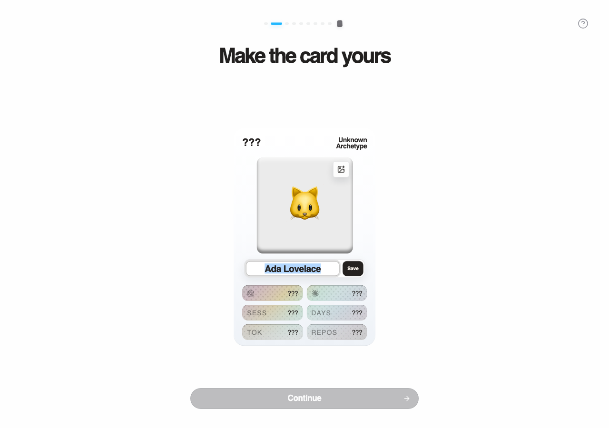
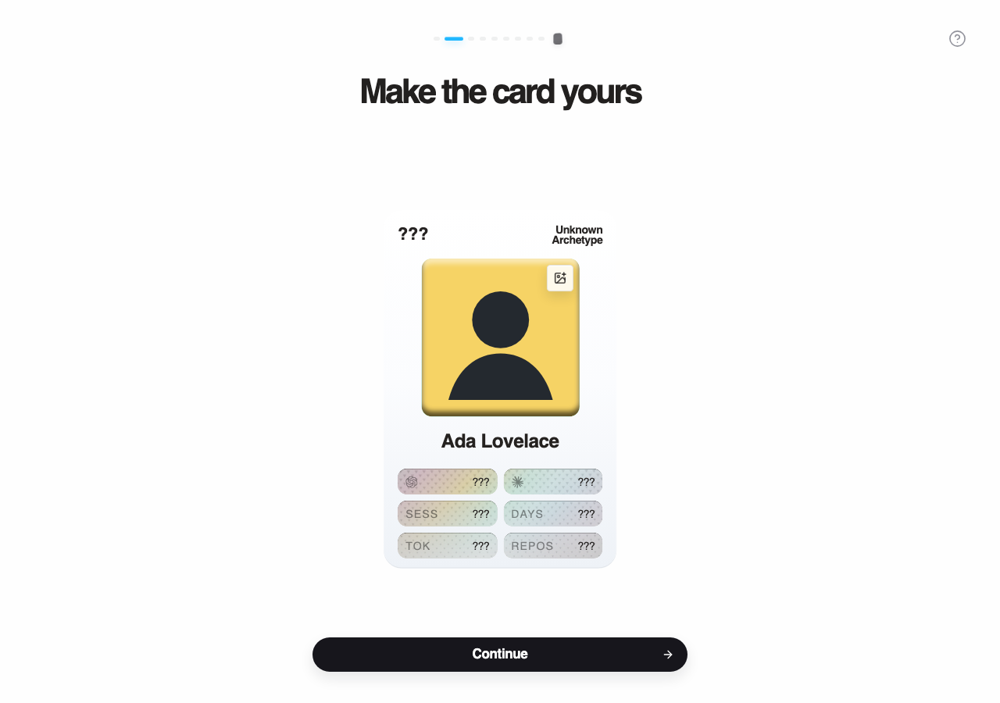
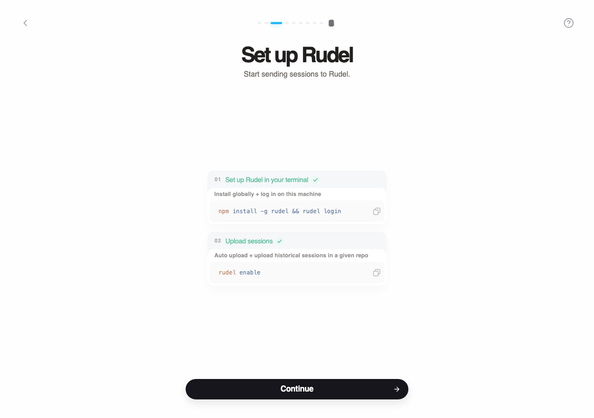
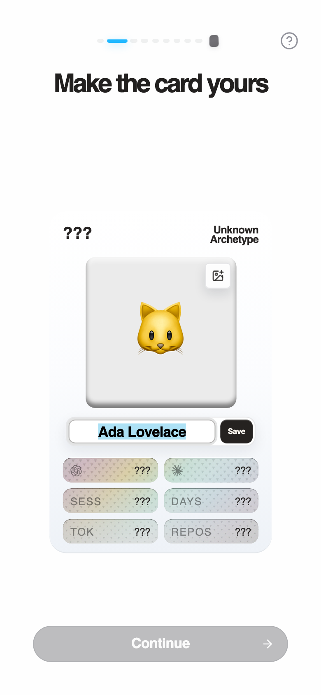

# Wrapped Fallback Profile Flow QA

This documents the fallback-avatar routing change for signed-in wrapped users
whose account has no real profile image.

The regression being covered: a signed-in user with only a generated/fallback
avatar could enter setup or story directly. The fixed flow sends them through
the card profile step first, requires a profile picture before continuing, and
then returns them to the normal setup progression.

## Flow Evidence

| Step | Expected route state | Screenshot |
| --- | --- | --- |
| Before fix | Fallback-only user skipped card profile and landed on setup. Continue is disabled because setup is not done. |  |
| After fix | Fallback-only user sees `Make the card yours` before setup. The card still uses fallback media and Continue is disabled. |  |
| After adding profile image and saving name | Profile image is present and Continue is enabled. |  |
| After continuing with existing sessions | User returns to setup with both setup steps complete and can continue into the sessions-landed/story flow. |  |
| Mobile layout check | Profile step stays usable in a narrow viewport with the bottom Continue control reachable. |  |

## Capture Assertions

The screenshot capture script asserted these states while capturing:

- Before-fix visual state contains setup and does not contain the profile step.
- Fixed required-profile state contains the profile step and does not contain setup.
- Continue is disabled while only fallback media is present.
- Continue is enabled after a profile image is present and the name is saved.
- Existing-session setup state has setup visible and Continue enabled.
- Mobile profile state has profile visible and Continue disabled before image upload.

## Automated Checks

Commands run from the PR worktree:

```bash
bun --filter @rudel/web test -- WrappedRouteGate.test.tsx
bun --filter @rudel/web check-types
bun run lint:wrapped:hig
node .context/capture-wrapped-fallback-profile-flow.mjs
```
