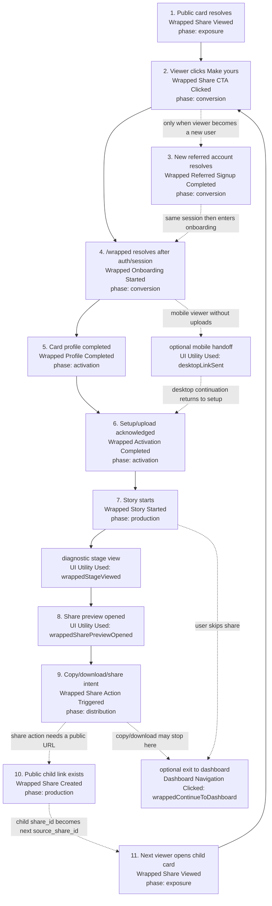

# Wrapped WOM Growth Loop Instrumentation

This is the current Reforge-style word-of-mouth loop for wrapped profile
sharing. Core loop events use `growth_loop: "wrapped_profile_wom"` so funnel and
loop queries can group them without relying on page names or generic UI utility
labels.

The diagram includes both core WOM events and the generic utility/navigation
events that sit between them. Utility/navigation events are useful for product
diagnostics, but the loop read should anchor on the core WOM events.



## Event Contract

### Common Web Envelope

All web analytics events include these properties from the shared capture layer:

| Property | Value |
| --- | --- |
| `event_version` | `1` |
| `surface` | `"web"` |
| `environment` | `"production"`, `"staging"`, `"development"`, or `"local"` |
| `page_name` | Typed app page name, usually `"wrapped_share"` or `"wrapped_team_card"` in this loop |
| `organization_id` | Current organization id when available |
| `user_id` | Current signed-in user id when available |
| `date_range_days` | Current analytics date range day count when available |
| `source_component` | Component that emitted the event |

### Core WOM Properties

Every core wrapped WOM event is validated by `WrappedGrowthLoopEventSchema` and
can carry these properties:

| Property | Meaning |
| --- | --- |
| `growth_loop` | Always `"wrapped_profile_wom"` |
| `loop_phase` | `"exposure"`, `"conversion"`, `"activation"`, `"production"`, or `"distribution"` |
| `entry_source` | `"public_share"`, `"share_redirect"`, `"wrapped_team_card"`, or `"direct"` |
| `source_share_id` | Parent share id that sourced the current user/session |
| `share_id` | Current or newly created public share id |
| `redirect_target` | CTA destination when a public viewer clicks into `/wrapped` |
| `archetype_id` | Card archetype id on share creation |
| `public_payload_version` | Wrapped public share payload version on share creation |
| `is_authenticated_viewer` | Whether a public share viewer already has a session |
| `is_new_user` | Whether this wrapped session is known to be from a new-user flow |
| `launch_channel` | Manual launch/spike label, such as `"hn"`, `"product_hunt"`, `"x"`, `"yc"`, or `"warm_dm"` |
| `referrer_domain` | External referrer host when available or preserved through the wrapped continuation URL |
| `resolved_entry_route` | Route where a post-share onboarding/activation event resolved |
| `activation_state` | Step-specific state such as `"upload_required"`, `"profile_completed"`, or `"setup_completed"` |
| `share_action` | `"copy"`, `"download"`, or `"share"` for distribution intent |
| `share_destination` | Known destination for distribution intent, currently `"clipboard"`, `"download"`, or `"x"` |
| `utm_source` | Launch/acquisition source from URL attribution |
| `utm_medium` | Launch/acquisition medium from URL attribution |
| `utm_campaign` | Launch/acquisition campaign from URL attribution |
| `utm_content` | Launch/acquisition content from URL attribution |
| `utm_term` | Launch/acquisition term from URL attribution |

`utm_*`, `launch_channel`, and `referrer_domain` are read from the current URL
for every core wrapped event. The public "Make yours" redirect preserves those
fields onto `/wrapped` so post-auth events keep the borrowed-loop/spike context.

### Core Event Payloads

| Event | Phase | Properties emitted by current code |
| --- | --- | --- |
| `Wrapped Share Viewed` | `exposure` | `growth_loop`, `loop_phase`, `entry_source: "public_share"`, `share_id`, `is_authenticated_viewer`, `is_new_user` when known, acquisition fields, `activation_state: "authenticated" \| "anonymous"`, `source_component: "wrapped_public_page"` |
| `Wrapped Share CTA Clicked` | `conversion` | `growth_loop`, `loop_phase`, `entry_source: "public_share"`, `share_id`, `redirect_target`, `is_new_user` when known, acquisition fields, `activation_state: "authenticated" \| "guest_redirect"`, `source_component: "wrapped_public_page"` |
| `Wrapped Referred Signup Completed` | `conversion` | `growth_loop`, `loop_phase`, `entry_source: "share_redirect"`, `source_share_id`, `is_new_user: true`, acquisition fields, `resolved_entry_route`, `activation_state: "signup_completed"`, `source_component: "wrapped_route_gate"` |
| `Wrapped Onboarding Started` | `conversion` | `growth_loop`, `loop_phase`, `entry_source: "share_redirect" \| "direct"`, `source_share_id` when present, `is_new_user`, acquisition fields, `resolved_entry_route`, `activation_state: "sessions_ready" \| "upload_required"`, `source_component: "wrapped_route_gate"` |
| `Wrapped Profile Completed` | `activation` | `growth_loop`, `loop_phase`, `entry_source: "share_redirect" \| "direct"`, `source_share_id` when present, `is_new_user: true`, acquisition fields, `resolved_entry_route`, `activation_state: "profile_completed"`, `source_component: "wrapped_route_gate"` |
| `Wrapped Activation Completed` | `activation` | `growth_loop`, `loop_phase`, `entry_source: "share_redirect" \| "direct"`, `source_share_id` when present, `is_new_user`, acquisition fields, `resolved_entry_route`, `activation_state: "setup_completed"`, `source_component: "wrapped_route_gate"` |
| `Wrapped Story Started` | `production` | `growth_loop`, `loop_phase`, `entry_source: "share_redirect" \| "wrapped_team_card"`, `source_share_id` when present, `activation_state: "story" \| "card_direct"`, `source_component: "wrapped_team_card_page"` |
| `Wrapped Share Action Triggered` | `distribution` | `growth_loop`, `loop_phase`, `entry_source: "share_redirect" \| "wrapped_team_card"`, `source_share_id` when present, `share_action: "copy" \| "download" \| "share"`, `share_destination: "clipboard" \| "download" \| "x"`, acquisition fields, `activation_state` mirroring `share_action`, `source_component: "wrapped_share_actions"` |
| `Wrapped Share Created` | `production` | `growth_loop`, `loop_phase`, `entry_source: "share_redirect" \| "wrapped_team_card"`, `source_share_id` when present, `share_id`, `archetype_id`, `public_payload_version`, `source_component: "wrapped_team_card_page"` |

### Auxiliary Events In The Same Flow

These are not core `wrapped_profile_wom` events, but they fill in the funnel path
between core milestones.

| Event | Trigger | Properties emitted by current code |
| --- | --- | --- |
| `UI Utility Used` | Mobile user sends a desktop continuation link | `utility_name: "desktopLinkSent"`, `component_id: "desktop_resume_prompt_page"`, `entry_source: "mobile_get_started"`, `share_id` when present, `target_id` when present, `utility_state: "emailSent" \| "linkReady"`, plus common envelope |
| `UI Utility Used` | Wrapped team-card page mounts | `utility_name: "wrappedStageViewed"`, `component_id: "wrapped_team_card_page"`, `utility_state: "cardDirect" \| "story"`, plus common envelope |
| `UI Utility Used` | User opens the final share preview | `utility_name: "wrappedSharePreviewOpened"`, `component_id: "wrapped_reveal_footer"`, `utility_state: "sharePreview"`, plus common envelope |
| `Dashboard Navigation Clicked` | User exits wrapped to dashboard | `nav_type: "wrappedContinueToDashboard"`, `source_component: "wrapped_reveal_footer" \| "wrapped_share_footer"`, `target_path: "/dashboard"`, `target_type: "route"`, `to_page_name: "overview"`, plus common envelope |

## Loop Read

Minimum viable WOM loop query:

1. Count `Wrapped Share Viewed` by `share_id`.
2. Join viewers who click `Wrapped Share CTA Clicked`.
3. Count `Wrapped Referred Signup Completed` to separate new referred users from
   existing-user continuations.
4. Follow post-auth users with `source_share_id` through onboarding, profile, and activation.
5. Count `Wrapped Share Action Triggered` by `share_action` and
   `share_destination` to separate copy, download, and X-share intent.
6. Count `Wrapped Share Created` where `source_share_id` is present.
7. Measure child output by joining the created `share_id` to the next wave of
   `Wrapped Share Viewed`.

The first loop-health ratio is:

```text
profile_sourced_child_shares / profile_share_views
```

The stronger loop spin ratio is:

```text
child_share_views / parent_share_views
```

The Reforge WOM coefficient read needs an active-user denominator outside this
wrapped loop. Use a weekly or monthly active user definition from product usage,
such as unique users with `Session Upload Completed`, `Dashboard Viewed`, or
another chosen active-user event in the same period:

```text
wrapped_referred_new_users / active_users
```

To isolate Reforge's "minimum scope" fuel, segment each step by `launch_channel`,
`utm_source`, `utm_campaign`, and `referrer_domain`. Launch spikes and borrowed
loops should increase first-cycle inputs; the durable loop is only spinning if
those inputs produce child shares and child share views.

Teammate invites are intentionally out of this pass. They should be modeled as a
separate invite loop unless product decides to merge invites into the wrapped WOM
loop.

Generic auth/sign-up instrumentation still exists separately (`Authentication
Action Triggered`, `Account Signed Up`). `Wrapped Referred Signup Completed` is
the loop-specific bridge for successful new referred users; generic auth
drop-off inside provider redirects is still diagnosed from the auth events.
