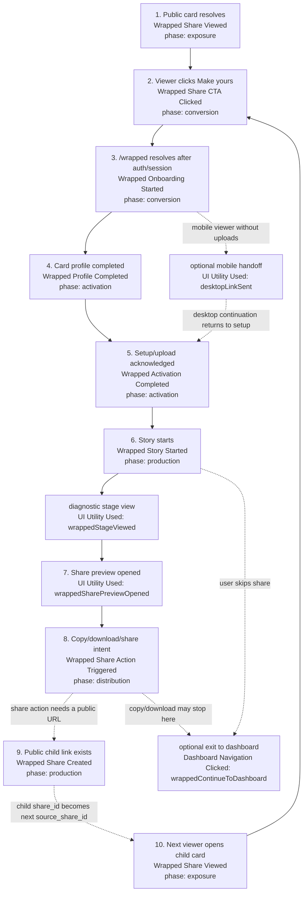

# Wrapped WOM Growth Loop Instrumentation

This is the current Reforge-style word-of-mouth loop for wrapped profile
sharing. Core loop events use `growth_loop: "wrapped_profile_wom"` so funnel and
loop queries can group them without relying on page names or generic UI utility
labels.

The diagram includes both core WOM events and the generic utility/navigation
events that sit between them. Utility/navigation events are useful for product
diagnostics, but the loop read should anchor on the core WOM events.



## Event Contract

### Common Web Envelope

All web analytics events include these properties from the shared capture layer:

| Property | Value |
| --- | --- |
| `event_version` | `1` |
| `surface` | `"web"` |
| `environment` | `"production"`, `"staging"`, `"development"`, or `"local"` |
| `page_name` | Typed app page name, usually `"wrapped_share"` or `"wrapped_team_card"` in this loop |
| `organization_id` | Current organization id when available |
| `user_id` | Current signed-in user id when available |
| `date_range_days` | Current analytics date range day count when available |
| `source_component` | Component that emitted the event |

### Core WOM Properties

Every core wrapped WOM event is validated by `WrappedGrowthLoopEventSchema` and
can carry these properties:

| Property | Meaning |
| --- | --- |
| `growth_loop` | Always `"wrapped_profile_wom"` |
| `loop_phase` | `"exposure"`, `"conversion"`, `"activation"`, `"production"`, or `"distribution"` |
| `entry_source` | `"public_share"`, `"share_redirect"`, `"wrapped_team_card"`, or `"direct"` |
| `source_share_id` | Parent share id that sourced the current user/session |
| `share_id` | Current or newly created public share id |
| `redirect_target` | CTA destination when a public viewer clicks into `/wrapped` |
| `archetype_id` | Card archetype id on share creation |
| `public_payload_version` | Wrapped public share payload version on share creation |
| `is_authenticated_viewer` | Whether a public share viewer already has a session |
| `is_new_user` | Reserved; currently not populated by the wrapped surfaces |
| `resolved_entry_route` | Route where a post-share onboarding/activation event resolved |
| `activation_state` | Step-specific state such as `"upload_required"`, `"profile_completed"`, or `"setup_completed"` |
| `share_action` | `"copy"`, `"download"`, or `"share"` for distribution intent |

### Core Event Payloads

| Event | Phase | Properties emitted by current code |
| --- | --- | --- |
| `Wrapped Share Viewed` | `exposure` | `growth_loop`, `loop_phase`, `entry_source: "public_share"`, `share_id`, `is_authenticated_viewer`, `activation_state: "authenticated" \| "anonymous"`, `source_component: "wrapped_public_page"` |
| `Wrapped Share CTA Clicked` | `conversion` | `growth_loop`, `loop_phase`, `entry_source: "public_share"`, `share_id`, `redirect_target`, `activation_state: "authenticated" \| "guest_redirect"`, `source_component: "wrapped_public_page"` |
| `Wrapped Onboarding Started` | `conversion` | `growth_loop`, `loop_phase`, `entry_source: "share_redirect" \| "direct"`, `source_share_id` when present, `resolved_entry_route`, `activation_state: "sessions_ready" \| "upload_required"`, `source_component: "wrapped_route_gate"` |
| `Wrapped Profile Completed` | `activation` | `growth_loop`, `loop_phase`, `entry_source: "share_redirect" \| "direct"`, `source_share_id` when present, `resolved_entry_route`, `activation_state: "profile_completed"`, `source_component: "wrapped_route_gate"` |
| `Wrapped Activation Completed` | `activation` | `growth_loop`, `loop_phase`, `entry_source: "share_redirect" \| "direct"`, `source_share_id` when present, `resolved_entry_route`, `activation_state: "setup_completed"`, `source_component: "wrapped_route_gate"` |
| `Wrapped Story Started` | `production` | `growth_loop`, `loop_phase`, `entry_source: "share_redirect" \| "wrapped_team_card"`, `source_share_id` when present, `activation_state: "story" \| "card_direct"`, `source_component: "wrapped_team_card_page"` |
| `Wrapped Share Action Triggered` | `distribution` | `growth_loop`, `loop_phase`, `entry_source: "share_redirect" \| "wrapped_team_card"`, `source_share_id` when present, `share_action: "copy" \| "download" \| "share"`, `activation_state` mirroring `share_action`, `source_component: "wrapped_share_actions"` |
| `Wrapped Share Created` | `production` | `growth_loop`, `loop_phase`, `entry_source: "share_redirect" \| "wrapped_team_card"`, `source_share_id` when present, `share_id`, `archetype_id`, `public_payload_version`, `source_component: "wrapped_team_card_page"` |

### Auxiliary Events In The Same Flow

These are not core `wrapped_profile_wom` events, but they fill in the funnel path
between core milestones.

| Event | Trigger | Properties emitted by current code |
| --- | --- | --- |
| `UI Utility Used` | Mobile user sends a desktop continuation link | `utility_name: "desktopLinkSent"`, `component_id: "desktop_resume_prompt_page"`, `entry_source: "mobile_get_started"`, `share_id` when present, `target_id` when present, `utility_state: "emailSent" \| "linkReady"`, plus common envelope |
| `UI Utility Used` | Wrapped team-card page mounts | `utility_name: "wrappedStageViewed"`, `component_id: "wrapped_team_card_page"`, `utility_state: "cardDirect" \| "story"`, plus common envelope |
| `UI Utility Used` | User opens the final share preview | `utility_name: "wrappedSharePreviewOpened"`, `component_id: "wrapped_reveal_footer"`, `utility_state: "sharePreview"`, plus common envelope |
| `Dashboard Navigation Clicked` | User exits wrapped to dashboard | `nav_type: "wrappedContinueToDashboard"`, `source_component: "wrapped_reveal_footer" \| "wrapped_share_footer"`, `target_path: "/dashboard"`, `target_type: "route"`, `to_page_name: "overview"`, plus common envelope |

## Loop Read

Minimum viable WOM loop query:

1. Count `Wrapped Share Viewed` by `share_id`.
2. Join viewers who click `Wrapped Share CTA Clicked`.
3. Follow post-auth users with `source_share_id` through onboarding, profile, and activation.
4. Count `Wrapped Share Action Triggered` by `share_action` to separate copy,
   download, and public-share intent.
5. Count `Wrapped Share Created` where `source_share_id` is present.
6. Measure child output by joining the created `share_id` to the next wave of
   `Wrapped Share Viewed`.

The first loop-health ratio is:

```text
profile_sourced_child_shares / profile_share_views
```

The stronger loop spin ratio is:

```text
child_share_views / parent_share_views
```

Teammate invites are intentionally out of this pass. They should be modeled as a
separate invite loop unless product decides to merge invites into the wrapped WOM
loop.

Auth/sign-up instrumentation exists separately (`Authentication Action
Triggered`, `Account Signed Up`) and is not currently keyed into
`wrapped_profile_wom`. If we need drop-off inside auth, add a loop-specific auth
step with `source_share_id` rather than inferring it from generic auth events.
