# Wrapped WOM Growth Loop Instrumentation

This is the current Reforge-style word-of-mouth loop for wrapped profile sharing.
The loop is instrumented as `growth_loop: "wrapped_profile_wom"` so funnel and
loop queries can group all events without relying on page names or generic UI
utility labels.

```mermaid
flowchart LR
  A["Shared profile card viewed<br/>Wrapped Share Viewed<br/>phase: exposure"]
  B["Make yours clicked<br/>Wrapped Share CTA Clicked<br/>phase: conversion"]
  C["/wrapped opened with source_share_id<br/>Wrapped Onboarding Started<br/>phase: conversion"]
  D["Card profile completed<br/>Wrapped Profile Completed<br/>phase: activation"]
  E["Setup/upload completed<br/>Wrapped Activation Completed<br/>phase: activation"]
  F["Wrapped story started<br/>Wrapped Story Started<br/>phase: production"]
  G["New public share created<br/>Wrapped Share Created<br/>phase: production"]
  H["Copy/download/share intent<br/>Wrapped Share Action Triggered<br/>phase: distribution"]
  I["Next viewer opens child share<br/>Wrapped Share Viewed<br/>phase: exposure"]

  A --> B --> C --> D --> E --> F --> G --> H --> I
  G -. "share_id becomes child source_share_id" .-> I
```



## Event Contract

| Event | Phase | Required attribution |
| --- | --- | --- |
| `Wrapped Share Viewed` | `exposure` | `share_id`, `entry_source: "public_share"` |
| `Wrapped Share CTA Clicked` | `conversion` | `share_id`, `redirect_target`, `entry_source: "public_share"` |
| `Wrapped Onboarding Started` | `conversion` | `source_share_id` when arriving through an existing share |
| `Wrapped Profile Completed` | `activation` | `source_share_id` when sourced from a share |
| `Wrapped Activation Completed` | `activation` | `source_share_id` when sourced from a share |
| `Wrapped Story Started` | `production` | `source_share_id` when sourced from a share |
| `Wrapped Share Created` | `production` | `share_id`; also `source_share_id` when the creator came from a share |
| `Wrapped Share Action Triggered` | `distribution` | `share_action`; also `source_share_id` when sourced from a share |

## Loop Read

Minimum viable WOM loop query:

1. Count `Wrapped Share Viewed` by `share_id`.
2. Join viewers who click `Wrapped Share CTA Clicked`.
3. Follow post-auth users with `source_share_id` through onboarding, profile, and activation.
4. Count `Wrapped Share Created` where `source_share_id` is present.
5. Measure child output by joining the created `share_id` to the next wave of `Wrapped Share Viewed`.

The first loop-health ratio is:

```text
profile_sourced_child_shares / profile_share_views
```

The stronger loop spin ratio is:

```text
child_share_views / parent_share_views
```

Teammate invites are intentionally out of this pass. They should be modeled as a
separate invite loop unless product decides to merge invites into the wrapped WOM
loop.
